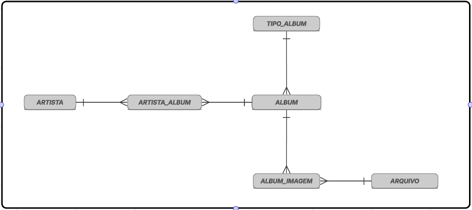

# Gerenciador de Discografia de Artistas

---

## 👤 CANDIDATO

**Inscrição:** 16377  
**Nome:** Amarildo de Arruda Assumpção Silva  
**CPF:** 830.495.331-53  
**Celular:** (9) 9281-6585  | **e-mail:** amaral77@gmail.com

---

## 💼 VAGA

**Cargo:** Analista de Tecnologia da Informação  
**Perfil:** Engenheiro da Computação  
**Projeto:** Projeto Desenvolvedor Back End

---

## 📦 PROJETO

## Gerenciador de Discografia de Artistas

O projeto é uma **API REST** desenvolvida com **Spring Boot**, utilizando **Docker**, **Java 21**, **PostgreSQL** como banco de dados e **MinIO** para armazenamento de arquivos.

---

## 🛠️ TECNOLOGIAS UTILIZADAS

- Java 21 com Spring Boot 3+
- PostgreSQL 17  
- MinIO `RELEASE.2023-10-07T15-07-38Z`

---

## 🚀 Funcionalidades Principais

- **Gestão de Discografia:** CRUD completo de Artistas e Álbuns com relacionamentos.

- **Upload de Mídias:** Integração com S3 (MinIO) para armazenamento de imagens.

- **Persistência:** Consultas otimizadas no PostgreSQL 17 utilizando Spring Data JPA.

---

## 🔌 PORTAS LIBERADAS

- **Swagger:** 8080  
- **PostgreSQL:** 5432  
- **MinIO:** 9000 e 9001
- **Nginx:** 80

---

## DIAGRAMA DAS TABELAS

<p align="center">
  
</p>


---

## 🚀 PASSOS PARA SUBIR A APLICAÇÃO NO DOCKER

## Comandos para o Bash

```bash
git clone https://github.com/amaral77cba/amarildodeaasilva830495.git
cd amarildodeaasilva830495
docker-compose build --no-cache
docker-compose up -d
```

## 📋 REQUISITOS DO SISTEMA E COMO TESTAR

1) Segurança: bloquear acesso ao endpoint a partir de domínios fora do domínio do serviço

	Através de qualquer navegador, acessar um site (ex: https://google.com)

	Pressionar F12 para abrir o console

	Execute:

	fetch("http://localhost:8080/api/v1/albuns")

	O sistema retornará erro de CORS (Access-Control-Allow-Origin)
	

2) Autenticação JWT com expiração a cada 5 minutos e possibilidade de renovação.
   
	Autenticação

	-acessar o swagger da API (http://localhost:8080/swagger-ui/index.html)

	-acessar a Autenticação em (POST Autenticação do usuário - **/api/v1/login**)

	-pressionar Try it out, informar as credenciais

		{
			"usuario": "amarildo",
			"senha": "123456"
		}

	-execute

	-copiar o accesstoken gerado na resposta

	-acessar o botao Autorize no canto superior direito do swagger

	-colar o accesstoken no campo value e pressiona Autorize

	-o token estará valido por 5 minutos

	
	
	Renovação

	-apos o token expirado é possivel fazer a renovação no Swagger

	-acessar a Autenticação em (POST Renova accessToken usando refreshToken - **/api/v1/refresh**)

	-pressionar Try it out

	-pressionar Execute

	-copiar o accesstoken gerado na resposta

	-acessar o botao Autorize no canto superior direito do swagger

	-aperta o Logout

	-cola o accesstoken gerado e pressione Authorize

	-o token foi renovado por 24horas
	
3) Implementar POST, PUT, GET.
   
	-acessar o swagger da API (http://localhost:8080/swagger-ui/index.html)

	-necessita realizar a autenticação para criar o accesstoken e liberar os endpoints

	-é apresentado uma lista de opções para fazer as ações em cada tabela da API, bastando informar os dados de parametros quando necessario.

	
4) Paginação na consulta dos álbuns
   
	-acessar o swagger da API (http://localhost:8080/swagger-ui/index.html)

	-necessita realizar a autenticação para criar o accesstoken e liberar o endpoint

	-acessar a Álbuns em (GET Listar álbuns com paginação - **/api/v1/albuns/pagina**)

	-pressionar Try it out

	-existe a opcao de informar via parametros a pagina e quantidade de registros por pagina

	-pressionar Execute

	-é apresentado na resposta o retorno dos dados executados
	
5) Expor quais álbuns são/tem cantores e/ou bandas (consultas parametrizadas).
   
	-acessar o swagger da API (http://localhost:8080/swagger-ui/index.html)

	-necessita realizar a autenticação para criar o accesstoken e liberar o endpoint

	-acessar o Artista x Álbum em (GET Consulta parametrizada de álbuns por artista - **/api/v1/artistas-albuns/consulta**)

	-pressionar Try it out

	-existe a opcao de informar nos parametros o tipo do artista juntamente com parte do nome do artista, o sistema irá consultar na tabela de vinculo os dados pertinentes para a consulta.

	-pressionar Execute

	-é apresentado na resposta o retorno dos dados executados
	
6) Consultas por nome do artista com ordenação alfabética (asc/desc).
   
	-acessar o swagger da API (http://localhost:8080/swagger-ui/index.html)

	-necessita realizar a autenticação para criar o accesstoken e liberar o endpoint

	-acessar o Artistas em (GET Listar artistas por tipo - **/api/v1/artistas/tipo/{tipo}**)

	-existe a opcao de informar nos parametros o tipo de artista e a ordenacao ascendente ou descendente

	-pressionar Execute

	-é apresentado na resposta o retorno dos dados executados

7)  Upload de uma ou mais imagens de capa do álbum.
   
	-acessar o swagger da API (http://localhost:8080/swagger-ui/index.html)

	-necessita realizar a autenticação para criar o accesstoken e liberar o endpoint

	-acessar o Álbuns em (GET Listar todos os álbuns - **/api/v1/albuns**) para recuperar os identificadores dos albuns pra ser utilizado no POST do Imagens do Album

	-acessar o Imagens dos Álbuns em (POST Adicionar imagem a um álbum - **/api/v1/albuns/{idenAlbum}/imagens**)

	-pressionar Try it out

	-informar nos parametros o campo Identificador do álbum um id recuperado na lista executada anteriormente, e no parametro file escolher o arquivo a ser anexado, existe a opcao de informar uma descricao para a imagem.

	-pressionar Execute

	-é apresentado na resposta o retorno dos dados executados

	-é possivel pela estrutura adicionar varias imagens ao mesmo album.
	
8)	Armazenamento das imagens no MinIO (API S3)
   
	-apos a inserção de uma ou mais imagens na etapa anterior e possivel visualizar a infra estrutura do S3 na url (http://localhost:9000)

	-autenticar no portal do MinIO com os dados. usuario: **minioadmin** e senha: **minioadmin123**

	-no portal eh possivel visualizar o bucket criado **bancoseletivo-arquivos**

	-clicando no bucket serah apresentado a lista de todas as imagens anexadas anteriormente.
	
9)  Recuperação por links pré-assinados com expiração de 30 minutos.
	
	-acessar o swagger da API (http://localhost:8080/swagger-ui/index.html)

	-necessita realizar a autenticação para criar o accesstoken e liberar o endpoint

	-acessar o Arquivos (GET Listar todos os arquivos - **/api/v1/arquivos**) para recuperar um registro de uuid a ser utilizado no proximo endpoint

	-pressionar Try it out

	-pressionar Execute

	-copiar um uuid apresentado na resposta do enpoint.

	-acessar o Arquivos (GET Gerar URL temporária para download de arquivo - **/api/v1/arquivos/download/{uuid}**)

	-informar nos parametros o uuid copiado no endpoint anterior e opcionalmente pode informar quantos minutos a URL ficara disponivel.
	
	-pressionar Execute
	
	-é apresentado na resposta o link para realizar o download.
	
	-copiar esse link e acessar um navegador colando o link na barra de endereço, obs o link estará disponivel ateh o tempo informado nos parametros do enpoint. Apos esse tempo o link estará expirado para download.
	
			
10) Versionar endpoints.	
	
	-foram criados endpoints para atualizacao dos dados dos Artistas, sao os endpoints: **/api/v1/artistas/{idenArtista}** e **/api/v2/artistas/{idenArtista}**
	
	-acessar o swagger da API (http://localhost:8080/swagger-ui/index.html)
	
	-necessita realizar a autenticacao para criar o accesstoken e liberar o endpoint
	
	-acessar o Artista (GET Listar artistas - **/api/v1/artistas**) para recuperar os identificadores dos artitas para ser utilizado no PUT do Artista
	
	-acessar o Artista (PUT Atualizar artista - **/api/v1/artistas/{idenArtista}**)
	
	-informar nos parametros o Identificador do artista recuperado na lista executada anteriormente, alterar os valores necessarios no body relativo ao nomeArtista e tipoArtista. Como está preenchido a sugestão de troca.
	
	-pressionar Execute
	
	-é apresentado na resposta o retorno dos dados executados
	
	-acessar o Artista (PUT Atualizar artista - **/api/v2/artistas/{idenArtista}**)
	
	-informar nos parametros o Identificador do artista recuperado na lista executada anteriormente, alterar os valores necessarios no body relativo ao nomeArtista e tipoArtista. Como está preenchido a sugestão de troca.
	
	-pressionar Execute
	
	-é apresentado na resposta o retorno dos dados executados
	
11) Flyway Migrations para criar e popular tabelas
	
	-o projeto foi configurado para utilizar o flyway com esta nas propriedades do arquivo application.properties spring.flyway.enabled=true
	
	-na pasta da aplicacao src/main/resources/db/migration encontra-se todos os arquivos DDL de banco para criacão das tabelas e inserção de dados iniciais
	
12) Documentar endpoints com OpenAPI/Swagger.
	
	-atraves da url (http://localhost:8080/swagger-ui/index.html) é possivel visualizar a documentacao de todos os endpoints disponiveis na API.
	
13) Health Checks e Liveness/Readiness
		
	-ir no Bash do projeto e executar os comandos 

	```bash
	-curl http://localhost:8080/actuator/health
	
	-curl http://localhost:8080/actuator/health/liveness
	
	-curl http://localhost:8080/actuator/health/readiness
 	```
	
	-para todos os casos será apresentado status UP
	
 
14) WebSocket para notificar o front a cada novo álbum cadastrado.
    
	-autenticar na aplicacao via (POST Autenticação do usuário - **/api/v1/login**), autorizar para liberar acesso aos endpoints

	-abrir um navegador digitar na URL http://localhost:8080/ws-notificacao.html essa pagina servira de front-end para receber as notifições

	-acessar o Álbuns (POST Criar álbum - **/api/v1/albuns**)

	-pressionar Try it out

	-informar os dados do novo album no body do endpoint

	-pressionar Execute

	-irá aparecer no pagina ws-notificacao a notificação de novo album cadastrado.

15) Rate limit: até 10 requisições por minuto por usuário.
	
	-acessar o swagger da API (http://localhost:8080/swagger-ui/index.html)
	
	-necessita realizar a autenticacao para criar o accesstoken e liberar o endpoint
	
	-acessar qualquer link, como exemplo indico o Tipo de Álbum (GET Listar tipos de álbuns - **/api/v1/tipos-album**)
	
	-Try on it e execute.
	
	-Repetir a ação de executar o endpoint por dez vez dentro de um minuto. Na décima primeira vez a resposta será retornada erro: 429 e a mensagem: Rate limit excedido: máximo de 10 requisições por minuto.

16) Endpoint de regionais (https://integrador-argus-api.geia.vip/v1/regionais):
	
	Importar a lista para tabela interna;
	
	Adicionar atributo “ativo” (regional (id integer, nome varchar(200), ativo boolean));
	
	Sincronizar com menor complexidade:	
	
	-este item foi implementado um endpoint para fazer toda a tratativa exposta no requisito. O endpoint acessa a API externa e insere os dados na tabela seguindo os criterios de insercao, alteracao na tabela.
	
	-acessar o swagger da API (http://localhost:8080/swagger-ui/index.html)
	
	-necessita realizar a autenticacao para criar o accesstoken e liberar o endpoint
	
	-acessar o Regionais (GET Sincronizar regionais com API externa - **/api/v1/regionais/sincronizar**) 
	
	-Try on it e execute
		
	-acessar o Regionais (GET Listar regionais ativas - **/api/v1/regionais**) para mostrar os dados inseridos.
	
	-Try on it e execute
	
	-é apresentado na resposta o resultado da sincronizaçãp.
		
17) Teste unitários
	
	Os testes unitarios, foram implementados em cima das regras do criterio abaixo.
	
	Novo no endpoint-> inserir;
	
	Ausente no endpoint-> inativar;
	
	Atributo alterado → inativar antigo e criar novo registro.
	
	-executar via Bash o comando
	
	```bash
	docker exec -it seletivo-api ./mvnw test
 	```
	
	-serah apresentado a implementacao das 3 regras aplicadas no teste.


